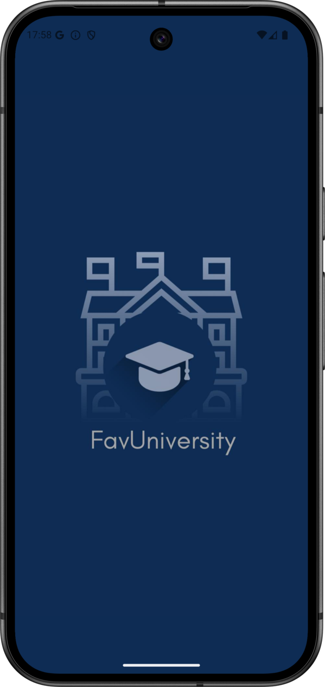
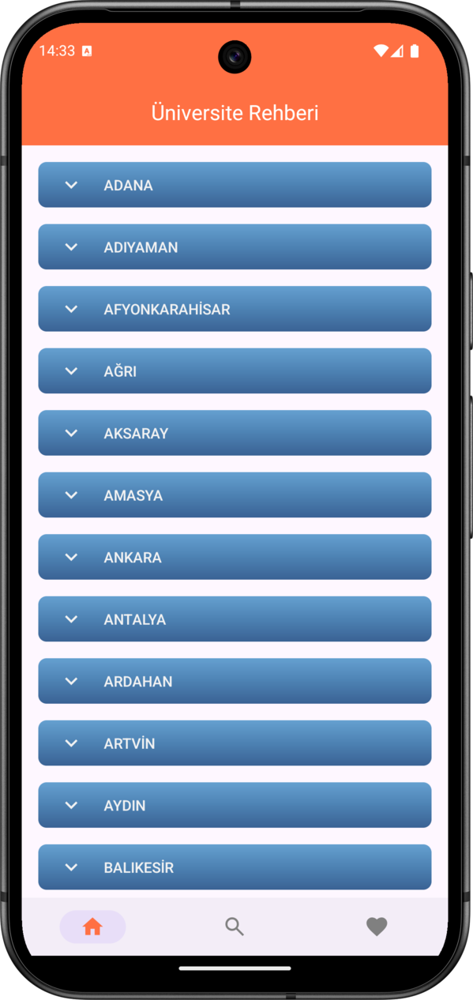
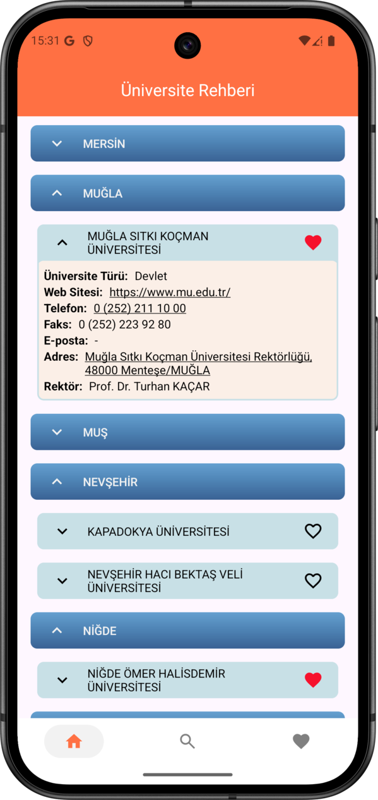
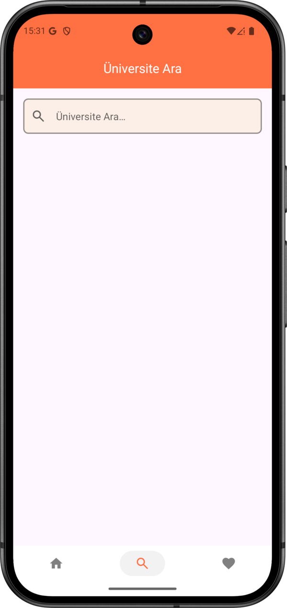
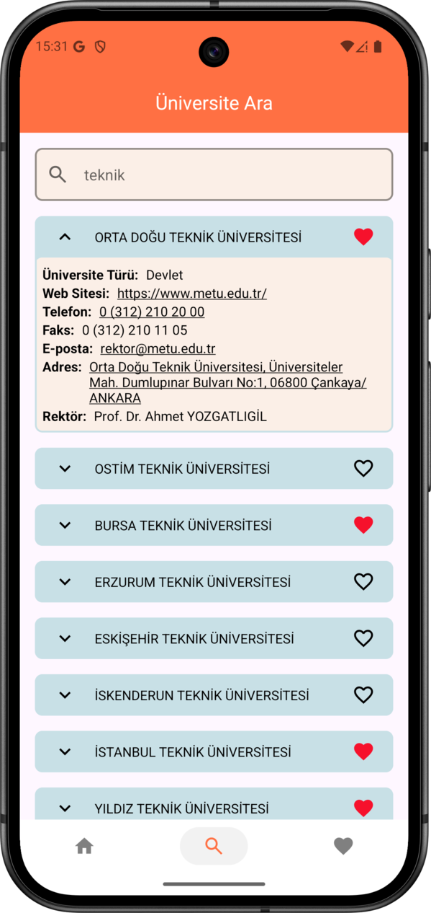
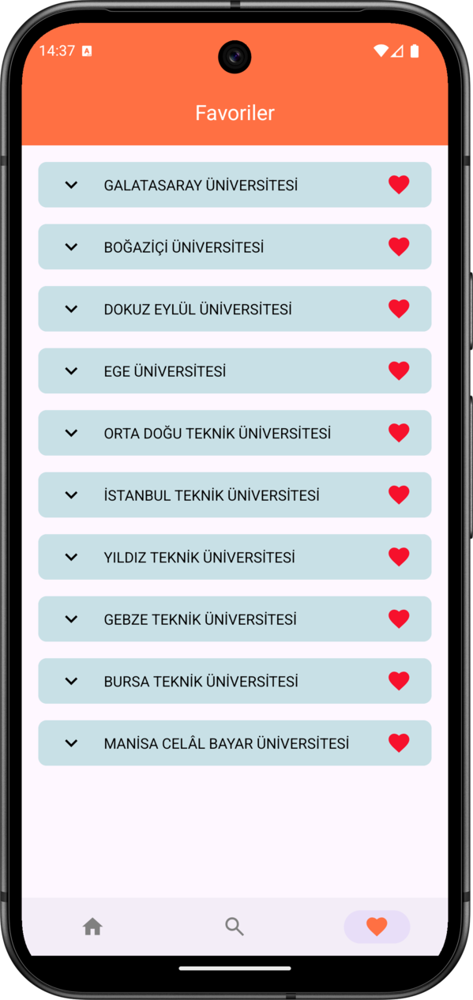
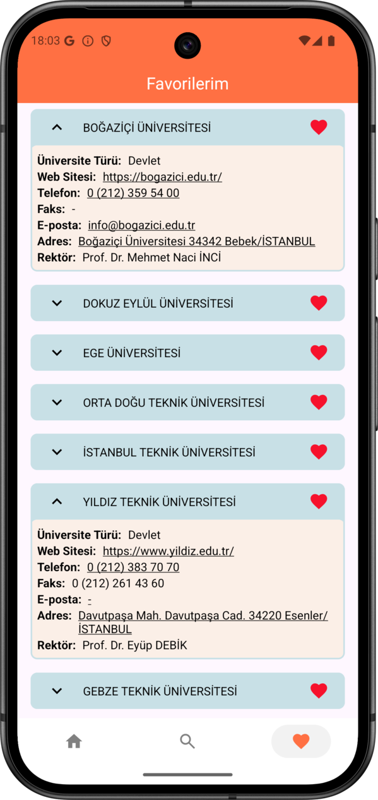
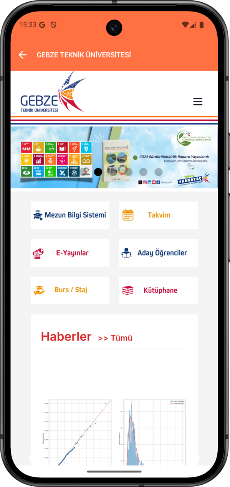

# FavUniversity

## 📸 Screenshots

  
  
  

  
  
  

  
  

## 📄 Project Overview

FavUniversity lists the cities in Türkiye and the universities within each city.

- Tap a city to expand and see its universities.
- Tap a university to expand its section and view details such as phone, address, rector, and website.
- You can directly call the university or open its website.
- Universities can be added to or removed from favorites, and all favorites are listed on a dedicated Favorites screen.

## 📌 Tech Stack

- **Architecture (MVVM + Clean Architecture)** – Layered, maintainable structure with separate `presentation`, `data`, `domain`, `core`, and `di` packages.
- **Kotlin Coroutines (Flow & StateFlow)** – Asynchronous and reactive data handling
    - `Flow` for data streams from API and Room
    - `StateFlow` for exposing UI state from ViewModels
- **Room Database** – Local persistence layer for storing and managing favorite universities.
- **Retrofit** – HTTP client for fetching city and university data from the REST API.
- **RecyclerView + ListAdapter (DiffUtil)** – Efficient list rendering, item animations, and partial updates for cities and universities.
- **Navigation Component** – Single-activity, multi-fragment navigation with a type-safe back stack.
- **Hilt (Dependency Injection)** – Simplifies dependency management and provides scoped components across layers.
- **ViewBinding** – Type-safe access to XML views without `findViewById`.
