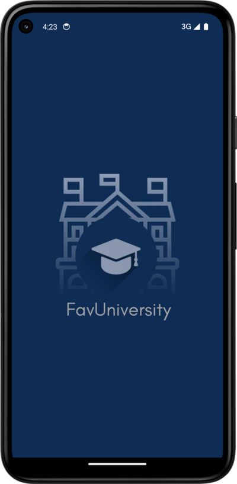
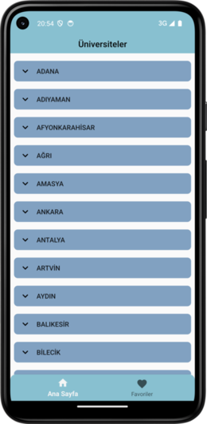
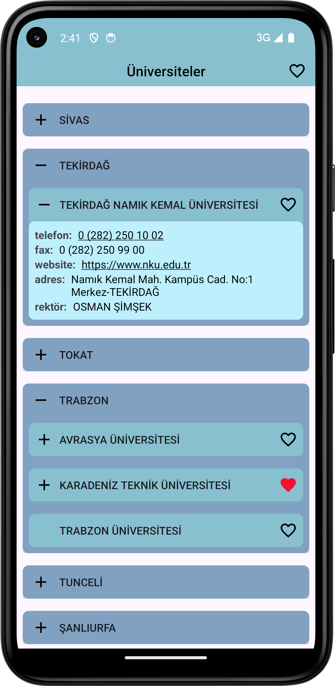
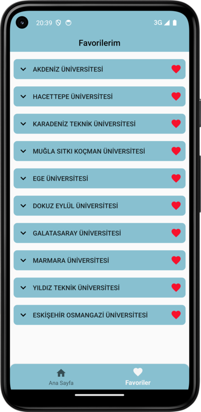
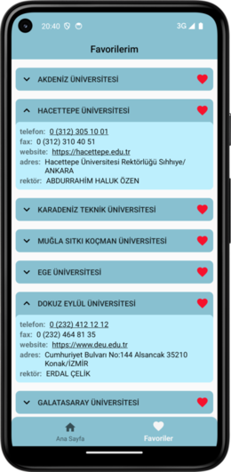
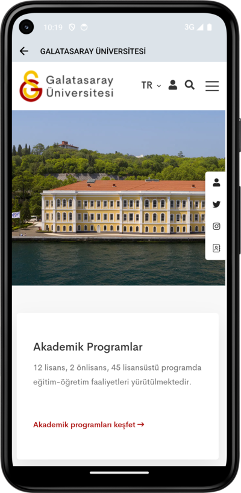

# FavUniversity

## 📸 Screenshots

  
  
  

  
  
  

## 📄 Project Overview

You can tap a city to expand and view the universities within on the main screen listing cities in Türkiye.
By tapping on a university, you can expand the section to examine university details, make a phone call,
or visit its website. You can add or remove universities from your favorites and view them in the
Favorites screen.

## 📌 Tech Stack
- **Clean Architecture** – Layered architecture for a scalable, testable, and maintainable codebase
- **Room Database** – Local database to store and manage favorite universities
- **Navigation Component** – Single activity multiple fragments approach
- **Retrofit** – For fetching city and university data via API requests
- **ViewModel & LiveData** – Managing UI data in a reactive way
- **Hilt (Dependency Injection)** – Simplifies dependency management for a modular codebase
- **ViewBinding** – Easy and type-safe access to XML layout views