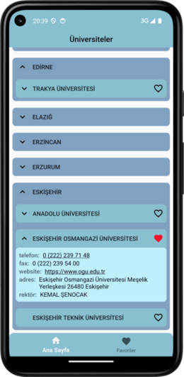
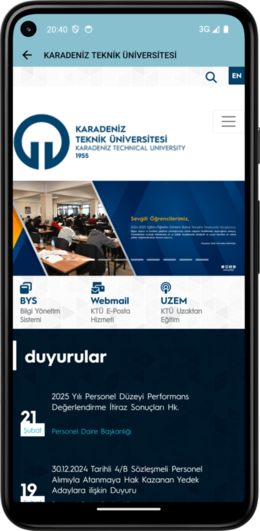

# FavUniversity

## Kullanılan Teknolojiler 
* Room Database
* Navigation
* Retrofit
* ViewModel & LiveData  
* Hilt (Dependency Injection)  

**Projenin Özeti**  

*Türkiye'deki şehirlerin ve üniversitelerin listelendiği bu uygulamada, listelenen şehirlere
tıklayarak genişleyen alanda, ilgili şehirdeki üniversitelerin listesi görüntülenir. Listelenen
üniversiteler favorilere eklenip çıkarılabilirler. Ayrıca üniversitelere tıklandığında alan
genişler ve üniversite bilgileri görüntülenir. Bu alandan üniversite websitesine gidebilir ve
telefon numarasına tıklayarak telefonla arayabiliriz. Bu projeyi Kotlin dilinde MVVM(Model-View-ViewModel) mimarisi ile bireysel olarak geliştirdim.* 

